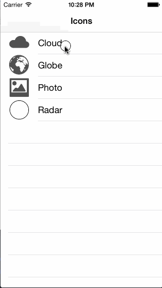

KBTemplateImage
===============

KBTemplateImage uses alpha channel of **one image**, to generate **many color tinted images**. Use it when you can not use UIImageRenderingModeAlwaysTemplate.


Watch it live:



Usage
-----

Simple to use and reuse:

``` objective-c
UIImage *alphaImage = [UIImage imageNamed:@"icon"];
KBTemplateImage *templateImage = [KBTemplateImage templateImageWithAlphaOfImage:alphaImage];

// make tinted images
UIImage *tintedImage = [templateImage imageTintedWithColor:[UIColor greenColor]];

// use tinted images for different button states
[button setImage:[templateImage imageTintedWithColor:[UIColor whiteColor]]
        forState:UIControlStateNormal];
[button setImage:[templateImage imageTintedWithColor:[UIColor lightGrayColor]]
        forState:UIControlStateHighlighted];
```

Installation
------------

Copy **Classes/KBTemplateImage.h** and **Classes/KBTemplateImage.h** to your project.
